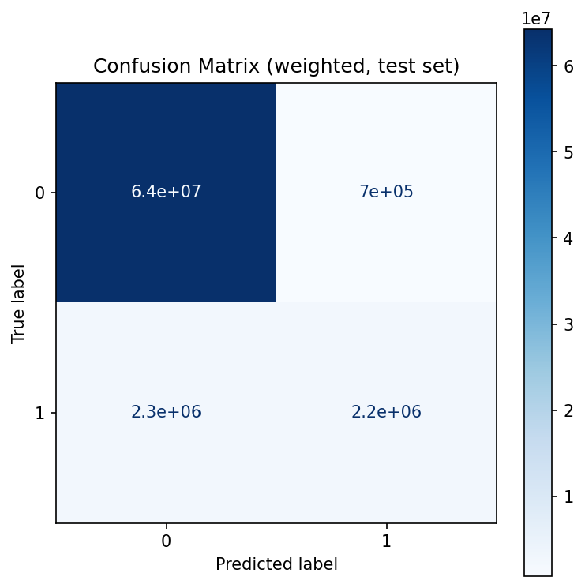
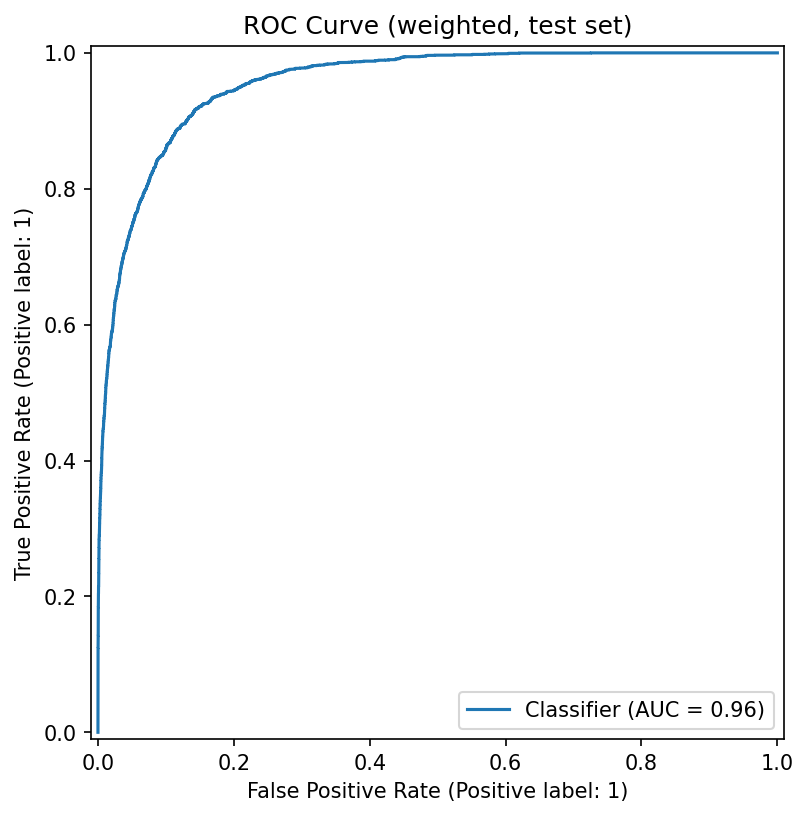
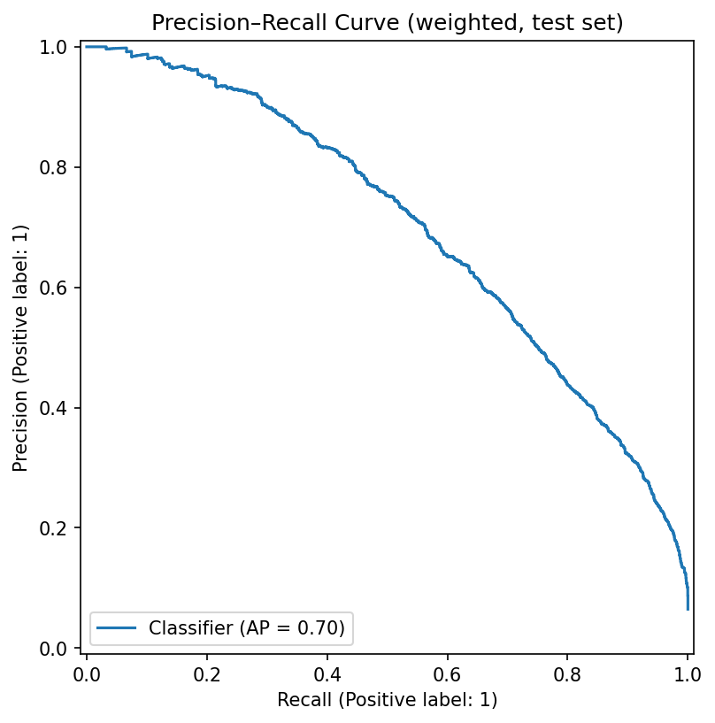
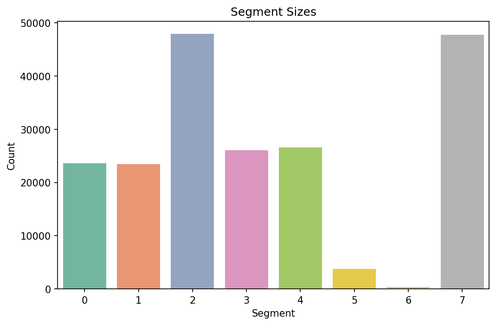

# Income Classification and Segmentation

This project uses U.S. Census Bureau Current Population Survey (1994–95) data to:
1. Train and evaluate a classifier that predicts whether a person earns more than $50,000.
2. Build a segmentation model to group people into marketing-relevant clusters.

---

## Objectives
- Identify high-income (>50K) vs low-income (<=50K) individuals.
- Provide marketing personas based on demographic and employment attributes.

---

## Setup

Clone the repo and create a virtual environment:

```powershell
cd jpm-project
python -m venv .venv
.venv\Scripts\activate
pip install -r requirements.txt
```

---

## Usage

1. Train & Evaluate Classifier

```powershell
python -m src.train_classify `
  --data_path data/census-bureau.data `
  --cols_path data/census-bureau.columns `
  --out_dir results
```

Outputs:
- results/best_classifier.pkl – saved model
- results/metrics.json – metrics (accuracy, precision, recall, etc.)

2. Segmentation

```powershell
python -m src.train_segments `
  --data_path data/census-bureau.data `
  --cols_path data/census-bureau.columns `
  --out_dir results `
  --k_min 3 --k_max 8
```

Outputs:
- results/segmentation_report.json – best k and silhouette
- results/segment_sizes.csv – segment sizes
- results/segments_summary.csv – segment profiles
- results/segment_personas.md – human-readable personas

---

## Results

Classifier results (Model: LightGBM)

- Accuracy: 95.7150%
- ROC-AUC: 0.9551
- PR-AUC: 0.6993
- Precision (high income): 0.7589
- Recall (high income): 0.493
- F1 score: 0.5977
- Confusion Matrix: 
|             | Predicted ≤50K | Predicted >50K |
| ----------- | -------------- | -------------- |
| Actual ≤50K | 64,250,904.6   | 702,197.0      |
| Actual >50K | 2,273,103.8    | 2,210,376.8    |

Segmentation result (k = 8, silhouette ≈ 0.22):

- Segment 0: Retired women, low income
- Segment 2: Retail workers, 11% >50K
- Segment 6: Professionals, 88% >50K
- Segment 7: Clerical workers, 10% >50K

---

## Visualizations

After running `python -m src.visualize`, the following plots are generated in `results/`:

- Confusion Matrix  
  

- ROC Curve  
  

- Precision–Recall Curve  
  

- Segmentation Sizes  
  

- Segmentation PCA Projection  
  

---

NOTES

- CPS sample weights were used for training to reflect population distribution.

- LightGBM was selected as the final classifier due to robustness with imbalanced data.

- Segmentation personas provide interpretable marketing groups.
